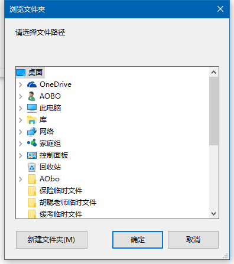

# 马克飞象笔记自动转换为Octopress本地站点博客和CSDN博客 --- 2016年11月11日 星期五


## GUI-Evernote-Auto-converted-to-Octopress-local-site-blog-and-CSDN-blog

### 2016年11月11日 ---


---

这个项目保存在GitHub上：https://github.com/AoboJaing/Evernote-to-Octopress-CSDN

本地路径：D:\WorkSpace\vs2010_ws\c#_ws\Evernote-to-Octopress-CSDN

使用的开发环境：VS2010
使用的编程语言：C#


---

## 1.0 设计这个软件，让它实现的功能：

通过马克飞象笔记写完并保持的文件，将这个文件自动转换到本地**Octopress**博客站点，接着在将其转换为CSDN博客。自动上传。

---

## 1.1 举例

现在我将马克飞象写好的笔记保持到本地（如果笔记里面有图片，保存就是一个压缩包，需要解压）：


通过我设计的这个软件，将这个文件里面的`.md`文件自动保存复制到：`F:\octopress\source\_posts`路径里面，同时将这个文件的名字修改为自定的名字，并且文件后缀改为：`.markdown`。
就这在`F:\octopress\source\images`路径里面创建一个自定义的名字的文件夹，并将所有的图片复制到这个新文件夹里面。
接着，我们修改`.markdown`文件里面的内容，将里面链接图片的路径全部设置为正确的路径。
这样，本地的**Octopress**博客站点就转换完成了，接着执行`rake preview` 预览本地博客。最后执行`rake generate`，然后执行 `rake deploy` 将博客站点上传到云端。

接着将得到的`.markdown`文件里面的内容复制一份，并将里面所有的链接图片的地址前面加上`http://www.aobosir.com/`，目的是为了得到正确的图片地址。

接着自动登入我的 CSDN 的账号，写博客，将内容粘贴到上面，发表。

---

## 1.2 所以，整个过程，用户需要输入

马克飞象笔记 转为 Octopress

1. 马克飞象笔记解压后的文件夹的路径（e.g. : `D:\WorkSpace\python_ws\NoteBook\Python 网络爬虫 011 (高级功能)  支持代理proxy — 让爬虫可以翻墙爬取网站 — Ongoing— 2016年9月19日 星期一`）
2. 重新命名的英文名字（e.g. :  `2016-9-19-Python-Web-Crawler-011-Proxy`）
3. Octopress本地站点路径（e.g. : `F:\octopress`）

---

Octopress 转为 CSDN

1. CSDN的用户名和密码
2. 博客的5个标签
3. 原创 和 博客分类 和 放置的地方


## 1.3 所以，分两个大步骤进行

1. 马克飞象笔记 转为 Octopress
2. Octopress 转为 CSDN

---

# 2 第一大步 ： 马克飞象笔记 转为 Octopress

## 2.0 详细的设计步骤

1. 设计GUI界面
2. 选择**马克飞象笔记解压后的文件夹的路径**
3. 复制文件夹里面的`.md`文件到目标文件夹里面
4. 并将`.md`文件的文件名改为指定的新的名字，并将后缀名改为`.markdown`
5. 在`F:\octopress\source\images`路径里面，新建一个文件夹（就以指定英文名创建）。
6. 将**马克飞象笔记解压后的文件夹的路径**里面的图片文件全部复制到刚刚创建的文件夹里面。
7. 调用`python`脚本 来修改`.markdown` 文件里面图片的地址
8. 调用 `python`脚本，执行命令行工具，来上传同步云端的博客站点。

---

## 2.1  设计GUI界面

## 2.2 选择**马克飞象笔记解压后的文件夹的路径**


> 参考网站：
> C# 浏览（选择）文件夹、打开文件夹、选择文件
> http://www.cnblogs.com/szytwo/archive/2012/03/21/2410041.html


GUI界面：


双击 **浏览...** 按钮，进入编辑控件事件。（自动生成下面的代码）

```cs
using System;
using System.Collections.Generic;
using System.ComponentModel;
using System.Data;
using System.Drawing;
using System.Linq;
using System.Text;
using System.Windows.Forms;

namespace Evernote_to_Octopress_CSDN
{
    public partial class Form1 : Form
    {
        public Form1()
        {
            InitializeComponent();
        }

        private void button1_Click(object sender, EventArgs e)
        {

        }
    }
}
```

在 `button1_Click(object sender, EventArgs e)` 函数里面添加下面的代码：（其中的`tbEvernoteFolder`是`textBox`控件对象，我自定义的名字）

```cs
        private void button1_Click(object sender, EventArgs e)
        {
            FolderBrowserDialog dialog = new FolderBrowserDialog();
            dialog.Description = "请选择文件路径";
            if (dialog.ShowDialog() == DialogResult.OK)
            {
                string foldPath = dialog.SelectedPath;
                tbEvernoteFolder.Text = foldPath;
            }
        }
```

---

搞定，现在运行试试：

点击浏览，弹出选择文件夹：



选择完毕，点击确定，`textBox` 控件对象中显示文件夹路径：


---

> 灵感：
> 对于打开指定文件夹、重命名文件、复制、粘贴、修改文件内容，都可以使用 **DOS 命令来解决**。
> 我可以这样做：用C#界面调用执行Dos命令文件，再用Dos命令调用执行Python脚本。
> 那么软件就设计起来就容易得多了。
> 
> 参考网站：
> C#程序调用cmd执行命令
> http://www.cnblogs.com/babycool/p/3570648.html
> 收集21个DOS常用命令
> http://www.jb51.net/article/12360.htm


---

# 3 第二大步 ： Octopress 转为 CSDN


